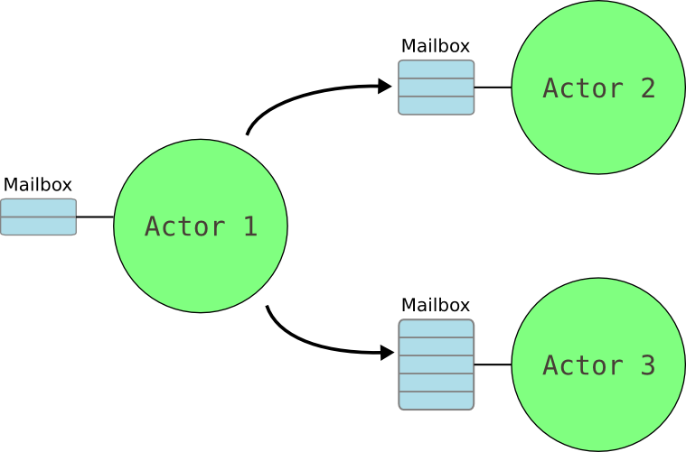

## Actor模型
由于`AKka`的核心是`Actor`，而`Actor`是按照`Actor`模型进行实现的，所以在使用`Akka`之前，有必要弄清楚什么是`Actor`模型。
`Actor模型`最早是1973年Carl Hewitt、Peter Bishop和Richard Seiger的论文中出现的，受物理学中的广义相对论([general relativity](https://en.wikipedia.org/wiki/General_relativity))和量子力学([quantum mechanics](https://en.wikipedia.org/wiki/Quantum_mechanics))所启发，为解决并发计算的一个数学模型。

`Actor模型`所推崇的哲学是"一切皆是Actor"，这与面向对象编程的"一切皆是对象"类似。
但不同的是，在模型中，Actor是一个运算实体，它遵循以下规则：
- 接受外部消息，不占用调用方（消息发送者）的CPU时间片
- 通过消息改变自身的状态
- 创建有限数量的新`Actor`
- 发送有限数量的消息给其他`Actor`

很多语言都实现了`Actor模型`，而其中最出名的实现要属`Erlang`的。`Akka`的实现借鉴了不少`Erlang`的经验。

## Actor模型的实现
`Akka`中`Actor`接受外部消息是靠`Mailbox`，参见下图


对于`Akka`，它又做了一些约束：
- 消息是不可变的
- Actor本身是无状态的

## 基本的Actor例子
本文用Maven管理一个Java的Akka项目。当日，你可以直接从https://developer.lightbend.com/start/?group=akka下载一个官方的例子。
### 引入依赖
```xml
<dependencies>
    <dependency>
        <groupId>com.typesafe.akka</groupId>
        <artifactId>akka-actor_2.12</artifactId>
        <version>${akka-version}</version>
    </dependency>
</dependencies>
```

### 编写Actor
通常情况下，我们只需要直接继承`AbstractActor`就足够了。
```java
public class EchoActor extends AbstractActor {

    private final LoggingAdapter log = Logging.getLogger(getContext().getSystem(), this);

    @Override
    public Receive createReceive() {
        return receiveBuilder()
                .match(String.class, s -> {
                    log.info("Received String message: {}", s);
                })
                .matchAny(o -> log.info("Received unknown message"))
                .build();
    }

}
```
`AbstractActor`要求必须实现createReceive()方法，该方法返回一个Receive定义了该Actor能够处理哪些消息，以及怎么处理。这里只简单的打印一个日志。

### Actor的启动
`Akka`中，用`ActorSystem`来管理所有的`Actor`，包括其生命周期及交互。
启动Actor，有两种方式
1. 使用内置的main方法
```java
akka.Main.main(new String[]{EchoActor.class.getName()});
```
这里会自动将EchoActor创建出来。

2. 手动创建`ActorSystem`
```java
ActorSystem system = ActorSystem.create("app");
ActorRef echoActor = system.actorOf(Props.create(EchoActor.class), "echoActor");
```
两种方法本质上其实是一样的，只不过第一种里面把创建`ActorSystem`等工作封装好了罢了。

> 注意：
> `ActorSystem`是一个较重的存在，一般一个应用里，只需要一个`ActorSystem`。
> 在同一个`ActorySystem`中，Actor不能重名。

### Actor的Path
`Akka`中的`Actor`不能直接被new出来，而是按一棵树来管理的，每个`Actor`都有一个树上的`path`：


实际上，在我们创建自己的`Actor`之前，`Akka`已经在系统中创建了三个名字中带有`guardian`的`Actor`：
- `/` 最顶层的 `root guardian`。它是系统中所有`Actor`的父，系统停止时，它是最后一个停止的
- `/user` `guardian`。这是用户自行创建的所有`Actor`的父。这里的user跟用户没有一毛钱关系
- `/system` 系统`guardian`

在上面的例子里，我们使用的是`system.actorOf`来创建`Actor`，`actorOf`返回的并不是`Actor`自身，而是一个`ActorRef`，它屏蔽了`Actor`的具体物理地址(可能是本jvm，也可以是其他jvm或另一台机器)。通过直接打印`ActorRef`看到`Actor`的`path`，比如本例是`/app/user/echoActor`。
像这种直接由system创建出来的`Actor`被称为顶层`Actor`，一般系统设计的时候，顶层`Actor`数量往往不会太多，大都由顶层`Actor`通过`getContext().actorOf()`派生出来其他的`Actor`。


### Actor间的相互调用(tell, ask)
在`Actor模型`中，`Actor`本身的执行是不占用被调用方(`akka`中的话是消息的发送者)的CPU时间片，所以，`akka`的`Actor`在相互调用时均是异步的行为。
- tell 发送一个消息到目标`Actor`后立刻返回
- ask 发送一个消息到目标`Actor`，并返回一个`Future`对象，可以通过该对象获取结果。但前提是目标`Actor`会有Reply才行，如果没有Reply，则抛出超时异常。

#### Tell： Fire-forget
```java
target.tell(message, getSelf());
```
其中第二个参数是发送者。之所以要带上这个是为了方便target处理完逻辑后，如果需要返回结果，可以也通过`tell`异步通知回去。
#### Ask: Send-And-Recieve-Future
```java
Future<Object> future = Patterns.ask(echoActor, "echo me", 200);
future.onSuccess(new OnSuccess<Object>() {
    @Override
    public void onSuccess(Object result) throws Throwable {
        System.out.println(result);
    }
}, system.dispatcher());
```
由于之前的`EchoActor`并没有返回Reply，所以这里什么都没打印。
修改`EchoActor`如下：
```java
@Override
public Receive createReceive() {
    return receiveBuilder()
            .match(String.class, s -> {
                log.info("Received String message: {}", s);
                ActorRef sender = getSender();
                if(!sender.isTerminated())
                    sender.tell("Receive: "+s, getSelf());
            })
            .matchAny(o -> log.info("Received unknown message"))
            .build();
}
```
由于前面两个消息的发送者是`ActorRef.noSender()`，所以`EchoActor`中`getSender()`返回的是`DeadLetter`的`ActorRef`，terminated值为真。只有最后的值打印出来：`Receive: echo me`


### Actor的停止
停止一个`Actor`有三种方法：
- 调用ActorSystem或getContext()的stop方法
- 给目标发送一个毒药消息：`akka.actor.PoisonPill.getInstance()`
- 给目标发送一个Kill消息： `akka.actor.Kill.getInstance()`

当使用前两种方法时，`Actor`的行为是：
1. 挂起它的`Mailbox`，停止接受新消息
2. 给它所有的子`Actor`发送stop命令，并等待所有子`Actor`停止
3. 最终停止自己

>由于停止`Actor`是一个异步的操作，在目标`Actor`被完全停止之前，如果要创建一个同名的`Actor`，则会收到`InvalidActorNameException`。

"kill"的方法略有不同，它会抛出一个`ActorKilledException`到父层去，由父层实现决定如何处理。
一般来说，不应该依赖于`PoisonPill`和`Kill`去关闭`Actor`。推荐的方法是自定义关闭消息，交由`Actor`处理。

如果需要等待关闭结果，可以采用PatternsCS.gracefulStop：
```java
import static akka.pattern.PatternsCS.gracefulStop;
import akka.pattern.AskTimeoutException;
import java.util.concurrent.CompletionStage;

try {
  CompletionStage<Boolean> stopped =
    gracefulStop(actorRef, Duration.ofSeconds(5), Manager.SHUTDOWN);
  stopped.toCompletableFuture().get(6, TimeUnit.SECONDS);
  // the actor has been stopped
} catch (AskTimeoutException e) {
  // the actor wasn't stopped within 5 seconds
}
```
发送一个自定义的消息，如Manager.SHUTDOWN，等待关闭，如果6秒未关闭，再去处理。
